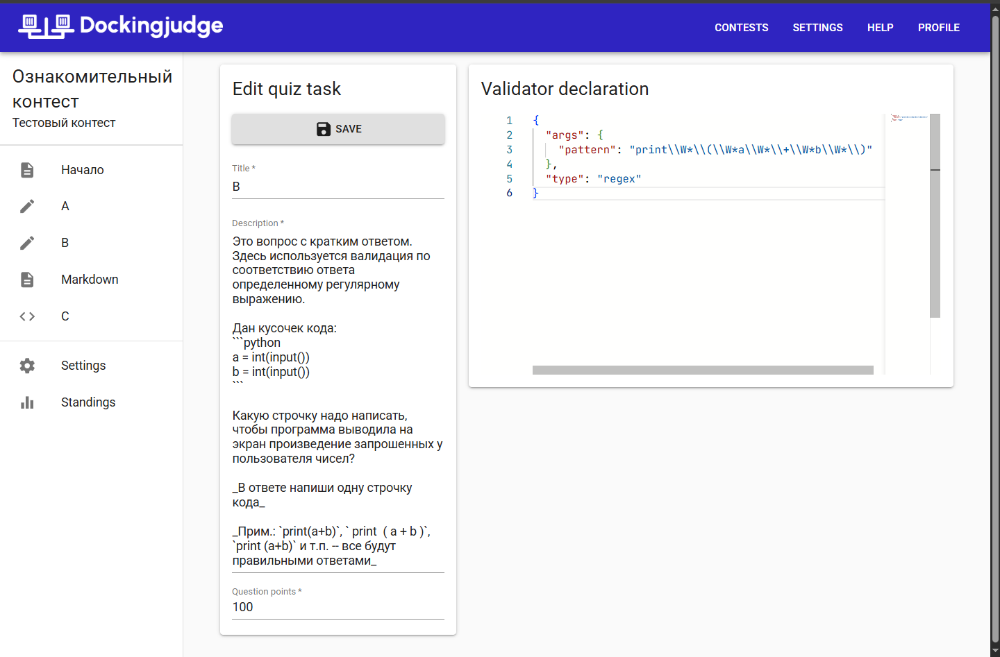

# Quiz tasks



## Checker declaration

Checker declaration is described in JSON:

=== "Schema"

    Schema defined in pseudo-pydantic:

    ```py
    Checker:
        args: dict[str, Any]
        type: str
    ```

=== "Example 1"

    ```json
    {
      "args": {
        "pattern": "123"
      },
      "type": "text"
    }
    ```

=== "Example 2"

    ```json
    {
      "args": {
        "pattern": "print\\W*\\(\\W*a\\W*\\+\\W*b\\W*\\)"
      },
      "type": "regex"
    }
    ```

## Available validators

### `text`

Validator args:

```py
pattern: str
case_insensitive: bool = False
strict_match: bool = True
```

### `regex`

Validator args:

```py
pattern: str
```
