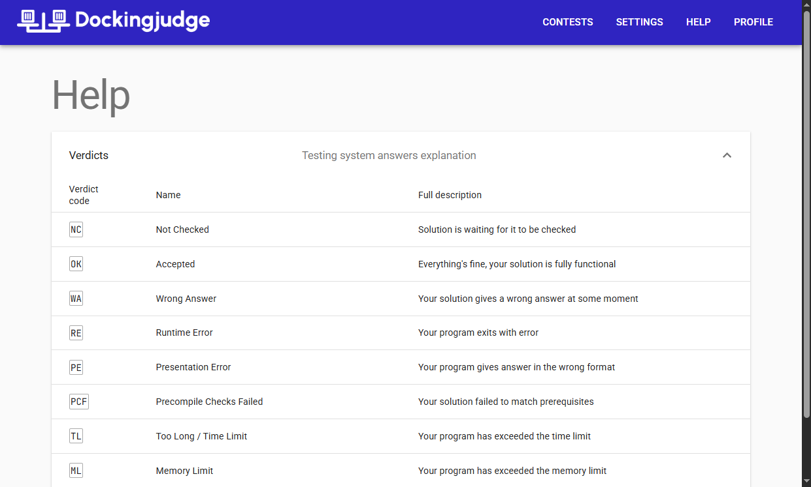
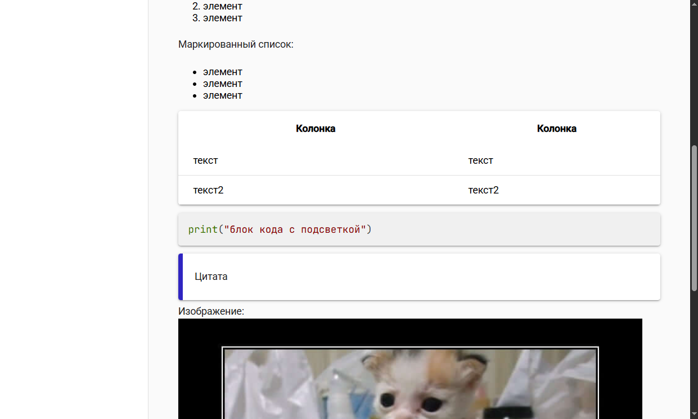
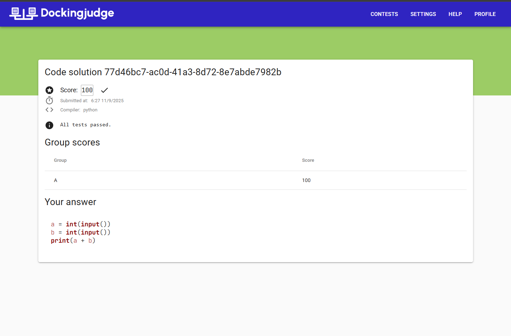

# Demo

Here you can see screenshots and demonstration of how Dockingjudge works.

## View all contests

## Localization of certain UI elements

## Checker responses description

## Markdown

## Simple task

## Code task

## View solution

## Standings

## Contest settings

## Simple task settings

## Code task settings

## Video

<video src="../../img/dockingjudge-demo.mp4" controls preload style="width: 100%"></video>
