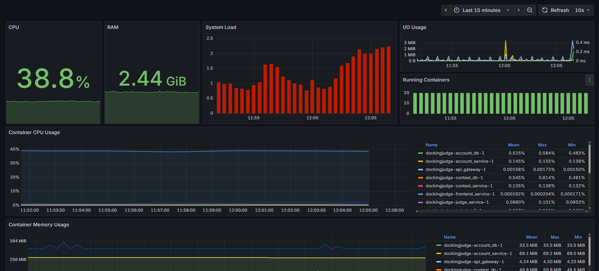
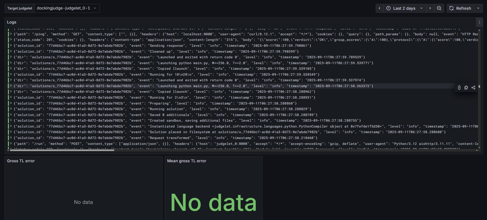
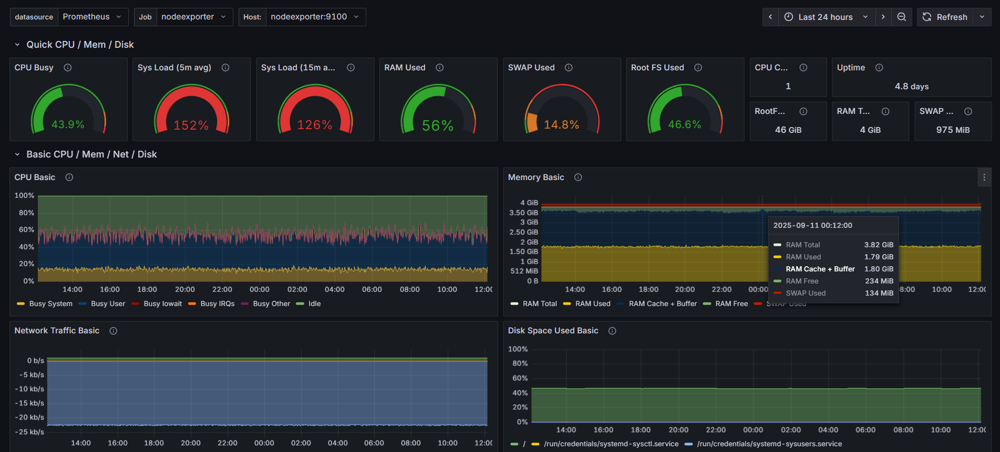

# Monitoring

Dockingjudge comes with a nice monitoring system built on Grafana, Loki and Prometheus.

## Containers 

Containers monitoring page, providing an overview of the Docker.

## Services

Services monitoring page, providing request and log info about critical services.

## Judgelets

Judgelet (judge unit) monitoring page, providing log info about checkers.

**TL Error** is a difference between actual running time and set time limit in case
of `TL` verdict.

## Node

Node monitoring page, providing summary of current node.

