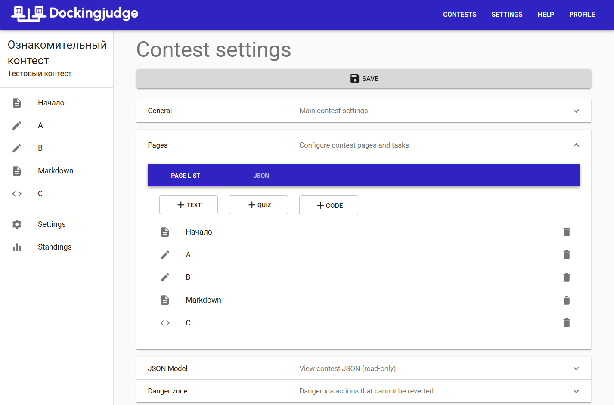

# Contests

After you've created a contest, you **must** create an entry page. To create it,
create a text page, then turn on "Is enter page?" toggle.

!!! warning
    This step is crucial. Without an entry page, no one will be able to participate.

At the moment, due to limitations, you cannot set time limit, so please don't try it
and just keep it -1.

## Start

To start the contest -- toggle "Is started?" in contest's settings.

## Moving pages

To move pages around, use JSON tab under "Pages" section. Beware not to mess
the contest up!

